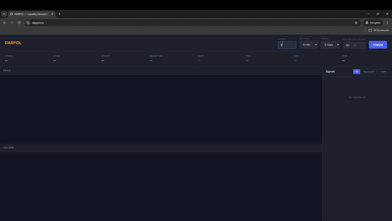

# DARPOL — Liquidity Absorption Detector

A statistical tool that analyzes stock price and volume data to detect patterns that *may* indicate institutional trading activity.



## What It Does

DARPOL looks for two specific patterns:

### 1. Absorption Signals (Cyan)
High volume bars where price barely moved. When a large order is executed but doesn't move the price, it suggests the order was "absorbed" by existing liquidity — potentially indicating institutional activity.

**Detection method:** Z-score based volume spike detection combined with price change threshold.

### 2. VWAP Snapback Signals (Purple)  
Price deviating significantly from VWAP (Volume Weighted Average Price) then snapping back. Institutional algorithms often execute around VWAP, so price returning to VWAP after deviation can indicate algorithmic execution.

**Detection method:** Z-score of price deviation from VWAP, tracking snapback events.

## Important Disclaimer

**This tool cannot definitively detect dark pool activity or institutional trades.** 

Dark pools are private by design — their order flow is not visible in public market data. What this tool detects are *patterns consistent with* institutional execution strategies, but these patterns can also occur naturally in regular market activity.

Use this as one input among many in your analysis, not as a definitive signal.

## Installation

```bash
# Clone the repo
git clone https://github.com/shayankjalali/darpol.git
cd darpol

# Install dependencies
pip install -r requirements.txt

# Run the app
python app.py
```

Then open `http://localhost:5000` in your browser.

## Usage

1. Enter a stock ticker (e.g., AAPL, TSLA, MSFT, or Canadian stocks like ET.TO)
2. Select time interval (1min to 1hour)
3. Select lookback period (1 day to 1 month)
4. Adjust absorption weight if desired (how much to weight absorption vs VWAP signals in the score)
5. Click **Analyze**

## How the Score Works

The score (0-100) is a weighted combination of:
- **Absorption signals:** Sum of log(1 + z-score) for each signal
- **VWAP signals:** Sum of log(1 + |z-score|) for each signal

The raw score is multiplied by a calibration factor derived from running the detector across multiple tickers (AAPL, TSLA, GME, SPY, etc.) to normalize the 0-100 range. Run `calibrate.py` to recalibrate if needed.

Higher scores indicate more detected patterns. A score of 100 means significant activity detected; a score near 0 means minimal activity.

## Tech Stack

- **Backend:** Python, Flask, pandas, yfinance
- **Frontend:** HTML, CSS, JavaScript, Chart.js
- **Data:** Yahoo Finance (via yfinance)

## Project Structure

```
darpol/
├── app.py              # Flask server
├── detector.py         # Signal detection algorithms
├── scorer.py           # Scoring logic
├── data_fetcher.py     # Yahoo Finance data fetching
├── config.py           # Calibration config
├── calibrate.py        # Calibration script
├── requirements.txt    # Dependencies
├── static/
│   ├── css/
│   │   └── style.css
│   └── js/
│       └── dashboard.js
└── templates/
    └── main.html
```

## Limitations

1. **Cannot see actual dark pool data** — Only infers from public price/volume
2. **False positives** — Normal market activity can trigger signals

## Future Improvements

- [ ] Add more signal types (iceberg orders, momentum ignition)
- [ ] Real-time streaming data
- [ ] Backtesting capabilities
- [ ] Multi-ticker comparison

## License

MIT

## Author

Built by Shayan Jalali as a learning project in quantitative finance.
